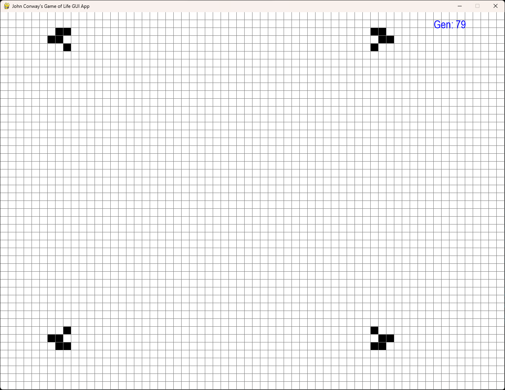

# PyGame-GameOfLife

Pygame implementation of John Conway's Game of Life, made as a school project.

## How to run

Requires PyGame and Numpy to be installed in the environment then run `main.py` with Python.  

## Controls
  - Left-Click – toggle tile state while paused
  - Spacebar – start or pause the game
  - s – save to file
  - l – load from file (gen# doesn’t save)
  - r – restarts the game
  - ESC – quits the game
  
